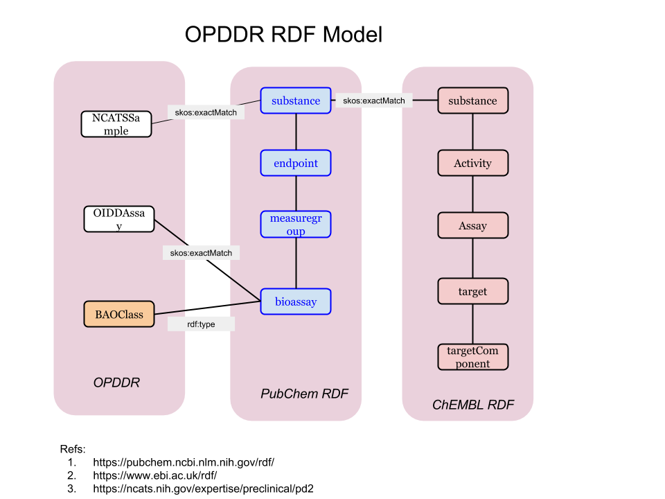

# `OPDDR`: Code, scripts and artifacts from the Open Phenotypic Drug Discovery Resource (OPDDR).

A collaboration between NCATS, Eli Lilly, Data2Discovery, Inc., and Indiana University (2015)

### See also:

 * [NIH NCATS Phenotypic Drug Discovery Resource](https://ncats.nih.gov/expertise/preclinical/pd2)
 * [Novel Phenotypic Outcomes Identified for a Public Collection of Approved Drugs from a Publicly Accessible Panel of Assays, JA Lee et al., Published: July 15, 2015](https://journals.plos.org/plosone/article?id=10.1371/journal.pone.0130796)
 * [NIH NCATS Public GitLab: DATA](https://spotlite.nih.gov/ncats/opdsr)
 * [PubChem data source established for this project](https://pubchem.ncbi.nlm.nih.gov/source/846)
 * [PubChem Summary BioAssay](https://pubchem.ncbi.nlm.nih.gov/bioassay/1117321)
 * [PubChem BioAssays (35 + summary)](https://www.ncbi.nlm.nih.gov/pcassay?term=%22Cheminformatics%20%26%20Chemogenomics%20Research%20Group%20%29CCRG%29%2C%20Indiana%20University%20School%20of%20Informatics%22%5BSourceName%5D%20hasnohold%5Bfilt%5D)

 * PubChem BioAssays: [1117322](https://pubchem.ncbi.nlm.nih.gov/bioassay/1117322), [1117323](https://pubchem.ncbi.nlm.nih.gov/bioassay/1117323), [1117324](https://pubchem.ncbi.nlm.nih.gov/bioassay/1117324), [1117325](https://pubchem.ncbi.nlm.nih.gov/bioassay/1117325), [1117326](https://pubchem.ncbi.nlm.nih.gov/bioassay/1117326), [1117327](https://pubchem.ncbi.nlm.nih.gov/bioassay/1117327), [1117328](https://pubchem.ncbi.nlm.nih.gov/bioassay/1117328), [1117329](https://pubchem.ncbi.nlm.nih.gov/bioassay/1117329), [1117330](https://pubchem.ncbi.nlm.nih.gov/bioassay/1117330), [1117331](https://pubchem.ncbi.nlm.nih.gov/bioassay/1117331), [1117332](https://pubchem.ncbi.nlm.nih.gov/bioassay/1117332), [1117333](https://pubchem.ncbi.nlm.nih.gov/bioassay/1117333), [1117334](https://pubchem.ncbi.nlm.nih.gov/bioassay/1117334), [1117335](https://pubchem.ncbi.nlm.nih.gov/bioassay/1117335), [1117336](https://pubchem.ncbi.nlm.nih.gov/bioassay/1117336), [1117337](https://pubchem.ncbi.nlm.nih.gov/bioassay/1117337), [1117338](https://pubchem.ncbi.nlm.nih.gov/bioassay/1117338), [1117339](https://pubchem.ncbi.nlm.nih.gov/bioassay/1117339), [1117340](https://pubchem.ncbi.nlm.nih.gov/bioassay/1117340), [1117341](https://pubchem.ncbi.nlm.nih.gov/bioassay/1117341), [1117342](https://pubchem.ncbi.nlm.nih.gov/bioassay/1117342), [1117343](https://pubchem.ncbi.nlm.nih.gov/bioassay/1117343), [1117344](https://pubchem.ncbi.nlm.nih.gov/bioassay/1117344), [1117345](https://pubchem.ncbi.nlm.nih.gov/bioassay/1117345), [1117346](https://pubchem.ncbi.nlm.nih.gov/bioassay/1117346), [1117347](https://pubchem.ncbi.nlm.nih.gov/bioassay/1117347), [1117348](https://pubchem.ncbi.nlm.nih.gov/bioassay/1117348), [1117349](https://pubchem.ncbi.nlm.nih.gov/bioassay/1117349), [1117350](https://pubchem.ncbi.nlm.nih.gov/bioassay/1117350), [1117351](https://pubchem.ncbi.nlm.nih.gov/bioassay/1117351), [1117352](https://pubchem.ncbi.nlm.nih.gov/bioassay/1117352), [1117353](https://pubchem.ncbi.nlm.nih.gov/bioassay/1117353), [1117354](https://pubchem.ncbi.nlm.nih.gov/bioassay/1117354), [1117355](https://pubchem.ncbi.nlm.nih.gov/bioassay/1117355), [1117356](https://pubchem.ncbi.nlm.nih.gov/bioassay/1117356), [1117321](https://pubchem.ncbi.nlm.nih.gov/bioassay/1117321) _(summary)_

## Knowledge Network Description

The initial version of the KN is intended to provide a clear and easily comprehensible first
step of describing the OPDDR compounds and assays in accordance with standardized
community ontologies and namespaces, and relating these to protein targets from ChEMBL.
Biological networks can be extremely complex, and many further entity classes can be
integrated in future (e.g. pathways), and will be facilitated by this initial KN.

## Ontologies Used
The KN uses the following ontologies:

| name | description|
|---|---|
| PubChem RDF | Primary reference for this project. Mainly because assays and substances have been deposited into PubChem.  <http://rdf.ncbi.nlm.nih.gov/pubchem/> |
| BAO | Bioassay classification. Initially using a minimal set based on annotation template provided by AstraZeneca. Only bao\_vocabulary\_assay.owl​ is required currently.  <http://www.bioassayontology.org/bao#> |
| ChEMBL RDF | ChEMBL, Reactome, Uniprot endpoint & downloads available.  CCO = ChEMBL Core Ontology <http://rdf.ebi.ac.uk/terms/chembl#> |
| OBO | Open Biological and Biomedical Ontologies BFO = Basic Formal Ontology <http://purl.obolibrary.org/obo/> |
| SIO | Semanticscience Integrated Ontology <http://semanticscience.org/resource/> |

## Entities:

| entity [abbr] namespace | example
|---|---|
| substance <http://rdf.ncbi.nlm.nih.gov/pubchem/substance/> | `SID124893119` |
| compound <http://rdf.ncbi.nlm.nih.gov/pubchem/compound/> | `CID1131` |
| assay (bioassay) <http://rdf.ncbi.nlm.nih.gov/pubchem/bioassay/> | `AID1117354` |
| measuregroup (measureg) <http://rdf.ncbi.nlm.nih.gov/pubchem/measuregroup/> | `AID1117354` |
| endpoint <http://rdf.ncbi.nlm.nih.gov/pubchem/endpoint/> | `SID124893119_AID1117354` |
| protein <http://rdf.ncbi.nlm.nih.gov/pubchem/protein/> | `GI124375976` |
| target <http://rdf.ebi.ac.uk/resource/chembl/target/> | `CHEMBL3038470` |
| targetcomponent (target_cmpt) <http://rdf.ebi.ac.uk/resource/chembl/targetcomponent/> | `CHEMBL_TC_1927` |
| UniprotRef (uniprot) <http://rdf.ebi.ac.uk/terms/chembl#UniprotRef> | `P53350` |
| assay <http://rdf.ebi.ac.uk/resource/chembl/assay/> | `CHEMBL987214` |
| activity <http://rdf.ebi.ac.uk/resource/chembl/activity/> | `CHEMBL_ACT_2470294` |
| molecule <http://rdf.ebi.ac.uk/resource/chembl/molecule/> | `CHEMBL44884` |

Note that PubChem compounds are required in addition to substances. Compounds refer to
canonically defined and identifiable chemical entities which can be linked across databases;
Substances refer to specific samples of compounds as provided by a supplier. We thus
include both, to be as comprehensive and specific as possible. Note also that PubChem
measuregroups are defined for each assay, for example, the measuregroup URI for
AID12345 is http://rdf.ncbi.nlm.nih.gov/pubchem/measuregroup/AID12345. PubChem
endpoints represent activity outcomes. ChEMBL RDF represents bioactivities somewhat
differently than PubChem, but we can rigorously link these data via chemical structure and
CIDs.

## KN Statistics

| type |count |notes |
|---|---|---|
| substance |2511 |PubChem SIDs |
| compound |2511 |PubChem CIDs |
| assay |35 |PubChem AIDs. Summary AID is 36th. |
| measuregroup |35 |PubChem AIDs. Default for assay. |
| endpoint |2511*35 |PubChem SID-­AID pairs. |
| targets |4977 |ChEMBL IDs. All single­component. |
| protein |4977 |A.k.a. target component. With UniprotRefs. |
| protein activity |584,157 |From ChEMBL, but includes PubChem data. |
| PD2 activity |5320 |All “ACTIVE” outcomes from results. |
| assay classifications | 155 |Manually curated PD2 to BAO associations. Exported from worksheet. |

## Asserted triplets, patterns and examples

| description | examples |
|---|---|
| assay to BAO class | `bioassay:AID1117354 rdf:type bao:BAO_0000015` |
| assay title | `bioassay:AID1117354 dcterms:title "human JAK2 kinase inhibition­screen"@en` |
| assay to measuregroup | `bioassay:AID1117354 bao:BAO_0000209 measuregroup:AID1117354` |
| substance to NCGC ID | `substance:SID144206486 skos:exactMatch ncats_sample:NCGC00182710­02 .` |
| substance to measure group | `substance:SID124882766 obo:BFO_0000056 measureg:AID1117326` |
| endpoint outcome (activity) | `endpoint:SID170466632_AID743241 vocabulary:PubChemAssayOutcome vocabulary:inactive` |
| endpoint class | `endpoint:SID103164874_AID443491 rdf:type bao:BAO_0000190` |
| substance to compound association | `substance:SID124893119 sio:CHEMINF_000477 compound:CID1131` |
| assay to OIDD ID | `bioassay:AID1117350 skos:exactMatch oidd_assay:17` |
| ChEMBL target to UniProt | `chembl_target:CHEMBL5464 cco:targetXref uniprot:Q13546` |
| ChEMBL target to assay | `chembl_target:CHEMBL5464 cco:hasAssay assay:CHEMBL3110727` |
| ChEMBL target to target component | `chembl_target:CHEMBL1867 cco:hasTargetComponent chembl_targetcmpt:CHEMBL_TC_180` |
| ChEMBL target component to Uniprot | `chembl_targetcmpt:CHEMBL_TC_180 cco:targetCmptXref uniprot:P08913` |
| ChEMBL assay to activity | `assay:CHEMBL3110727 cco:hasActivity activity:CHEMBL_ACT_13890030` |
| ChEMBL molecule to activity | `chembl_molecule:CHEMBL313842 cco:hasActivity activity:CHEMBL_ACT_14447741` |
| PubChem substance to ChEMBL molecule | `substance:SID225144242 skos:exactMatch molecule:CHEMBL1474122` |

## OPDDR RDF schema, simplified, showing source relationships

## Files:

The following files comprise this release. Files are grouped below by source, each file from
one source only.

| file | source | description |
|---|---|
| npcpd2\_assay.ttl | OPDDR | Assay links to OIDD namespace.  `bioassay:AID1117326 skos:exactMatch oidd_assay:4` |
| npcpd2\_bao.ttl | OPDDR | Manually curated BAO classifications.  `bioassay:AID1117352 rdf:type bao:BAO_0000219` |
| npcpd2\_substance.ttl | OPDDR | Substance links to NCATS namespace.  `substance:SID170465644 skos:exactMatch ncats_sample:NCGC00160518­03` |
| bao\_vocabulary_assay.owl | BAO | BAO module with bioassay class hierarchy. |
| pubchem\_vocabulary.owl | PubChem | PubChem module with bioactivity terms etc. |
| pubchem\_pd2\_assay.ttl | PubChem | PubChem RDF, includes titles, measuregroups.  `bioassay:AID1117356 bao:BAO_0000209 measuregroup:AID1117356 bioassay:AID1117351 dcterms:title "Increased HeLa cells with 4N DNA content­IC50"@en` |
| pubchem\_pd2\_substance.ttl | PubChem | PubChem RDF, includes CIDs, measuregroups.  `substance:SID124882766 obo:BFO_0000056 measuregroup:AID1117326 .  endpoint:SID124882766_AID1117342 obo:IAO_0000136 substance:SID124882766 .` |
| pubchem\_pd2\_endpoint.ttl | PubChem | PubChem RDF, includes endpoints, activity results.  `endpoint:SID170464708_AID1117354 obo:IAO_0000136 substance:SID170464708 ; vocabulary:PubChemAssayOutcome vocabulary:inactive .  measuregroup:AID1117354 obo:OBI_0000299 endpoint:SID170464708_AID1117354 .` |
| chembl\_cco.ttl | ChEMBL | ChEMBL Core Ontology |
| chembl\_target.ttl | ChEMBL | ChEMBL protein targets.  `chembl_target:CHEMBL2366239 a cco:SingleProtein ; dcterms:title "KLE"` |
| chembl\_rdf\_activity.ttl | ChEMBL | PubChem substance links to ChEMBL molecules, activities, assays, targets, target components, Uniprots.  `substance:SID170466134 skos:exactMatch chembl_molecule:CHEMBL1230222 chembl_molecule:CHEMBL44884 cco:hasActivity chembl_activity:CHEMBL_ACT_7667167 .  chembl_target:CHEMBL218 cco:hasAssay chembl_assay:CHEMBL1909122 .  chembl_target:CHEMBL218 cco:hasTargetComponent chembl_targetcmpt:CHEMBL_TC_172 .  chembl_targetcmpt:CHEMBL_TC_172 cco:targetCmptXref uniprot:P21554 .  uniprot:P21554 a cco:UniprotRef .`  |

## Project Status, Future

This initial KN Beta Version provides sufficient associations for semantic exploration across
PD2 phenotypic and public biochemical assays for the NPC substances. The integration with
PubChem, ChEMBL, and OpenPHACTS adds value in multiple ways, linking to a large,
diverse and expanding ecosystem of public biomedical knowledge. Additional assay
annotations can add further value, whereby the knowledge model developed can represent
and derive high value from the unique knowledge of domain specialists and facilitate the links which power and advance data intensive research.

Refs/links:

 - <https://ncats.nih.gov/expertise/preclinical/pd2>
 - <https://pubchem.ncbi.nlm.nih.gov/rdf/>
 - <http://bioassayontology.org/>
 - <https://www.ebi.ac.uk/rdf/>
 - <http://www.obofoundry.org/>
 - <http://semanticscience.org/>

